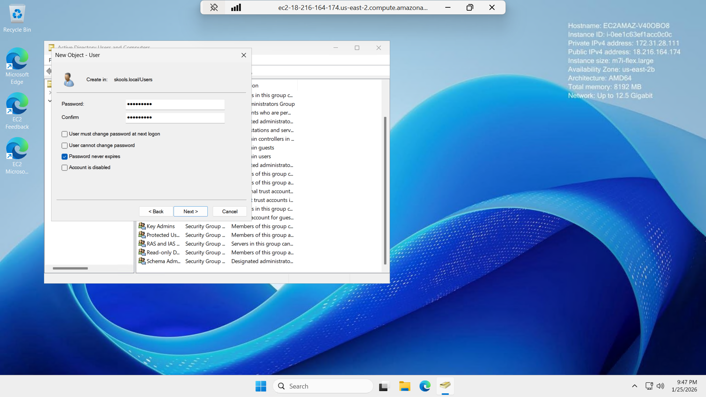
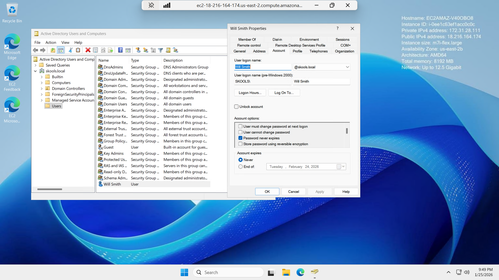

# Active-Directory-User-Management
Creating a new domain user in Active Directory Users and Computers (ADUC), setting password options, and verifying the account in the domain.
# Creating a User in Active Directory (ADUC)

## 🎥 Watch me build this lab here
**Watch me build this lab here:** [Loom Video Link](https://www.loom.com/share/7f76cc5fd3294dacac963a14ead1a864) 

---

## Objective
Create a new Active Directory user account in **Active Directory Users and Computers (ADUC)** and apply a basic security setting (**Password never expires**) for lab/testing purposes.

## Skills Practiced
- Navigating **Active Directory Users and Computers (ADUC)**
- Creating a new user in a domain (**skools.local**)
- Setting a password and validating account options
- Verifying successful account creation and reviewing user properties

## Tools Used
- Windows Server (Domain Controller)
- Active Directory Domain Services (AD DS)
- Active Directory Users and Computers (ADUC)

---

## Steps Performed

### 1) Created a new user account (Will Smith) in ADUC
Opened **skools.local → Users**, started the **New Object - User** wizard, and entered user identity + logon values.

---

### 2) Set an initial password + selected a lab security option
Configured an initial password and selected **Password never expires** (common in labs; not recommended for production accounts).

---

### 3) Verified successful creation + reviewed user properties
Confirmed the user appears under **Users** and validated settings in the user’s **Properties**.

---

## Outcome
- Successfully created a new AD user in **skools.local**
- Applied account option **Password never expires** for lab use
- Verified the user object exists and is configurable via ADUC

## Notes
- In real environments, “Password never expires” is typically avoided and controlled by policy.
- Next practice: create an **OU**, move the user into it, and apply a simple **GPO** (e.g., desktop wallpaper or password policy baseline).
