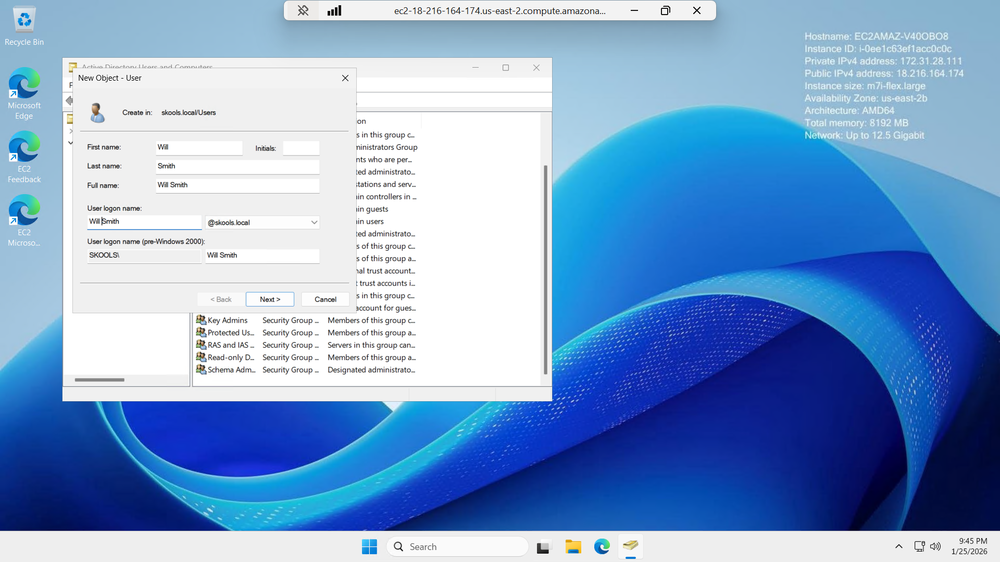

# Active-Directory-User-Management
Creating a new domain user in Active Directory Users and Computers (ADUC), setting password options, and verifying the account in the domain.
# Creating a User in Active Directory (ADUC)

## Watch me build this lab here
[Watch me build this lab here](https://www.loom.com/share/7f76cc5fd3294dacac963a14ead1a864)

---

## Objective
Create a new user in Active Directory Users and Computers (ADUC), set a secure password, and verify the user exists in the domain.

## Skills Demonstrated
- Navigating ADUC and locating the correct container (e.g., `skools.local > Users`)
- Creating a new domain user account
- Applying password settings (secure password, “Password never expires” where appropriate)
- Verifying the account was created successfully

## Tools Used
- Windows Server (Domain Controller)
- Active Directory Users and Computers (ADUC)

---

## Steps Performed

### 1) Create the user account (New Object – User)
Filled in required user details (e.g., name and logon name) and proceeded through the wizard.

### 2) Set a secure password + configure password options
Entered and confirmed a strong password and selected the appropriate options (example shown: “Password never expires”).

### 3) Verify successful creation of the user
Confirmed the user appears in ADUC and reviewed properties to validate key account settings.

---

## Outcome
Successfully created a new Active Directory user and verified the account configuration in ADUC.
